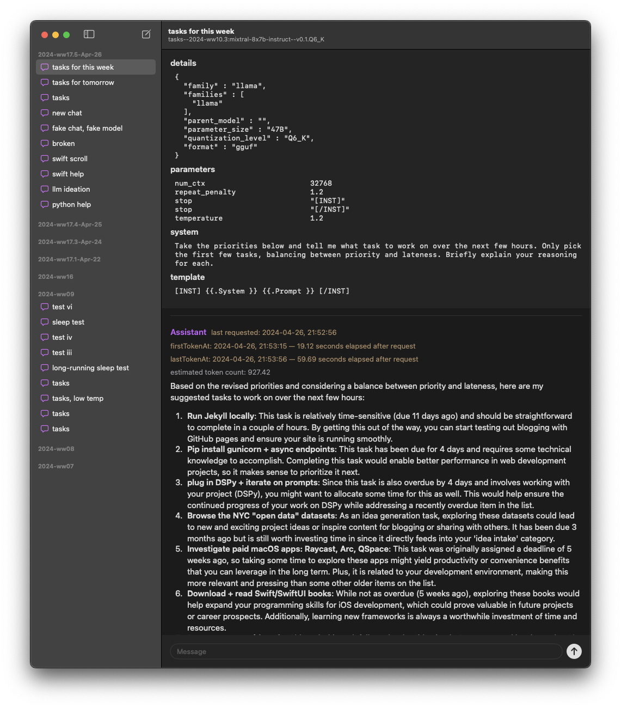

## Prerequisites

Before using Ollamac, ensure the following requirements are met:

- **Operating System**: macOS 14 or later.
- **Ollama Setup**: The Ollama system should be installed on your Mac. Ensure you have at least one Ollama model downloaded for interaction.

## Screenshot

  <picture>
    <source media="(prefers-color-scheme: dark)" srcset="./assets/screenshot-dark.webp">
    
  </picture>

## Acknowledgements

- [Ollamac](https://github.com/kevinhermawan/Ollamac)
- [OllamaKit](https://github.com/kevinhermawan/OllamaKit)
